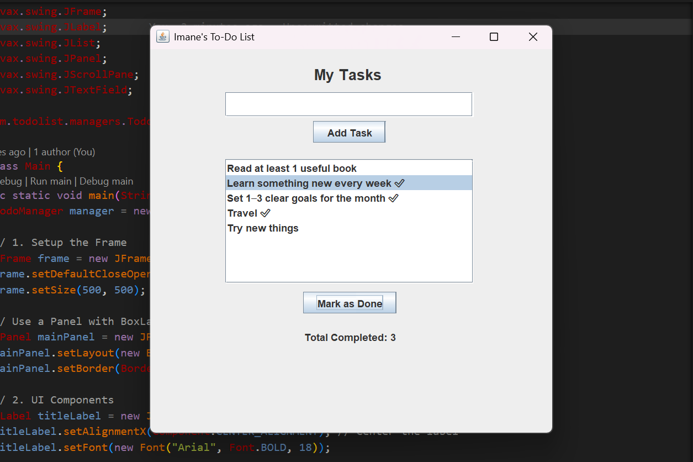

# 📝 Todo List Project - Java Swing

This is a simple, professionally structured **To-Do List Manager** built with **Java 21**. It follows the **OOP (Object-Oriented Programming)** principles to separate logic from UI.

---

## 🖼️ Application Preview



---
## 🚀 Key Features

This project is built using a robust technical stack to ensure scalability and maintainability:

- **Java 21**: Utilized the latest LTS features for a modern and secure codebase.  
- **Java Swing Framework**: Implemented GUI components (JTextField, JList, JButton) to create an interactive desktop experience.  
- **Maven Build System**: Managed dependencies and project lifecycle for easy compilation and build consistency.  

### 🏗️ MVC-like Architecture

- **Models**: Define application data structure (`Task` class).  
- **Managers**: Handle business logic and data processing (`TodoManager`).  
- **Views**: Responsible for UI rendering and user interaction (`Main` class).  

- **Collections Framework**: Uses `ArrayList` for dynamic and memory-efficient data storage.  
- **Event-Driven Programming**: Handles user actions (add / mark as done) using `ActionListener` and `DefaultListModel`.  
- **Layout Management**: Uses `BoxLayout` for a clean, centered, and responsive UI design.  

---

## 📁 Project Structure

The project is divided into three main parts:

1. **`com.todolist.models.Task`**: The blueprint for a single task (Description & Status).
2. **`com.todolist.managers.TodoManager`**: The "Brain" that handles the `ArrayList` and calculations.
3. **`com.todolist.Main`**: The "Face" of the app that builds the GUI and handles events.

---

## 🎓 What I Learned

- Object-Oriented Programming (OOP) in real projects  
- Building GUIs with Java Swing  
- Event-driven programming  
- Managing data using ArrayList  
- Applying MVC architecture in a desktop app  

## 🛠️ How to Run

1. Ensure you have **JDK 21** and **Maven** installed.
2. Clone or copy the source files.
3. Run the following command in your terminal to compile:

---

   ```bash
   mvn clean install
   ```

---

4. Run the following command in your terminal to run the app:

   ```bash
   mvn exec:java -Dexec.mainClass="com.todolist.Main"
   ```

---

## 📝 License

This project is licensed under the MIT License - see the [LICENSE](LICENSE) file for details.

---

## 👩‍💻 Developed By

Imane - Software Development Student
